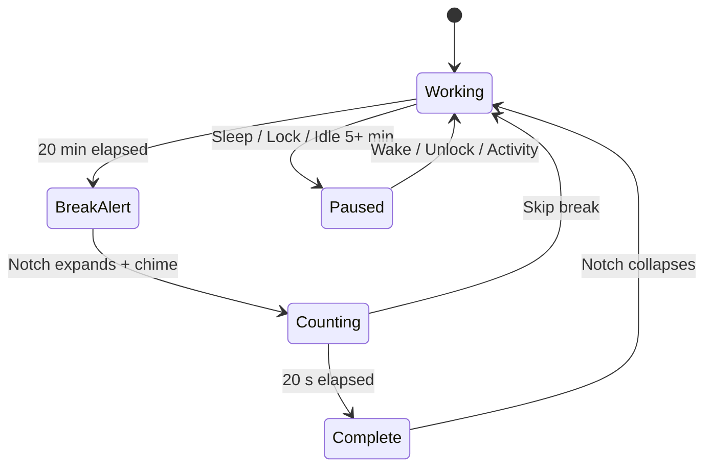
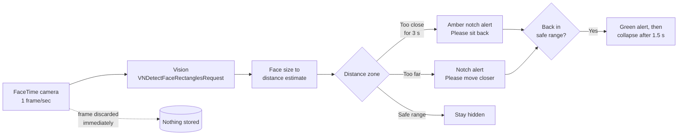

<div align="center">


****# EyeBreak****

****### The 20-20-20 rule, delivered by your MacBook's notch.****

A native macOS menu bar app that turns the camera notch into a ******Dynamic Island****** for eye health, and uses on-device computer vision to measure how far you're sitting and tell you when you're ******too close or too far****** from the screen.

<p>

  

  

  

  

  

</p>

<p>

  <a href="#-quick-start">Quick Start</a> ·

  <a href="#-features">Features</a> ·

  <a href="#-how-it-works">How It Works</a> ·

  <a href="#-engineering-highlights">Engineering Highlights</a> ·

  <a href="#-roadmap">Roadmap</a>

</p>

<!-- Replace with a real screen recording. Keep it under ~10 MB. -->


</div>

---

****## 👀 Why this exists****

Staring at a screen for hours causes digital eye strain: dry eyes, headaches, blurred vision. The standard advice is the ******20-20-20 rule******:

> Every ******20 minutes******, look at something ******20 feet****** away for ******20 seconds******.

Most reminder apps fail for one of two reasons: they're easy to ignore, or they're intrusive and steal focus from what you're doing. EyeBreak is built around fixing both:

| Problem with typical reminders | How EyeBreak solves it |

|---|---|

| Notifications are easy to dismiss and forget | An alert that physically expands out of the notch, so it's noticeable without being jarring |

| Pop-ups steal keyboard focus mid-typing | A strictly ******non-activating****** window that never takes focus from Xcode, a terminal, or a game |

| Timers keep running while you're away | Pauses on sleep, screen lock, and idle, then resumes when you return |

| Nothing checks ***how*** you sit | A camera-based ******distance guardian****** measures your sitting distance and warns you when you're too close ******or too far****** |

---

****## ✨ Features****

****### 🏝️ Dynamic Island for macOS****

- Detects the physical notch with `NSScreen.safeAreaInsets`, `auxiliaryTopLeftArea`, and `auxiliaryTopRightArea`

- Alert grows out of the notch with a spring animation and collapses back into it

- Continuous rounded bottom corners that match the notch geometry

- Graceful fallback to a centered pill on notchless Macs and external displays

- Shows on whichever screen your mouse cursor is on

****### 📏 Screen Distance Guardian****

- Uses the FaceTime camera and Apple's ******Vision****** framework (`VNDetectFaceRectanglesRequest`) to continuously measure your sitting distance

- ******Too close:****** lean in closer than roughly an arm's length (about 30 to 35 cm) for 3+ seconds and the notch turns ******amber******: ***"Too close to the screen • Please sit back"***

- ******Too far:****** the same face tracking notices when you've drifted far back from the screen and nudges you to move closer, so you aren't squinting at small text

- Return to a healthy range and it turns ******green****** (***"Safe Distance ✓"***) and collapses back into the notch after 1.5 seconds

- Adjustable sensitivity: ******Relaxed / Normal / Strict******

****### 🔒 Privacy by design****

- Everything runs ******on-device******. Frames are analyzed in memory and discarded immediately

- Video is ******never saved, recorded, or transmitted******

- Samples at about ******1 frame per second******, and the camera turns off entirely when the Mac is locked, asleep, or idle

****### 🧠 Smart pause and idle detection****

- Pauses on `NSWorkspace.willSleepNotification` and the `com.apple.screenIsLocked` distributed notification

- Auto-pauses after 5+ minutes of inactivity (configurable) using Quartz `CGEventSource`, and resumes when you're back

****### 🎛️ Polished menu bar experience****

- Pure menu bar app (`LSUIElement = true`): no Dock icon, no clutter

- Live countdown in the menu bar, with Pause/Resume, Take break now, Skip break

- Native SwiftUI settings: work interval and break duration sliders with presets, launch at login (`SMAppService.mainApp`), chime picker with preview

- Soft system chimes (Tink, Glass, Hero, Ping, and more) at break start and completion

---

****## 🎬 Screenshots****

<div align="center">

| Break alert | Distance warning | Safe distance | Settings |

|:---:|:---:|:---:|:---:|

|  |  |  |  |

</div>

<!-- Add the four images above to docs/assets/. Until then, GitHub will show broken-image placeholders. -->

---

****## 🚀 Quick Start****

******Requirements:****** macOS 13 Ventura or later. Xcode and the command line tools if you want to build from source.

```bash

# 1. Clone

git clone https://github.com/shiivu18/LookAway.git

cd LookAway

# 2. Build and package the .app

./scripts/build_app.sh

# 3. Run

open EyeBreak.app

```

<details>

<summary><b>Other ways to run it</b></summary>

******Open in Xcode******

```bash

open EyeBreak.xcodeproj   # select the EyeBreak target, press ⌘R

```

******Regenerate the Xcode project****** (it's generated from `project.yml` with [XcodeGen](https://github.com/yonaskolb/XcodeGen))

```bash

brew install xcodegen

xcodegen generate

```

******Swift Package Manager******

```bash

swift build -c release

```

</details>

> ******First launch:****** macOS will ask for camera permission the first time you enable Screen Distance. The break timer works without it.

---

****## 🧭 How It Works****

****### The 20-20-20 state machine****



****### The distance guardian pipeline****



****### Notch geometry****

The positioning math lives in [`ScreenNotchDetector.swift`](Sources/Utils/ScreenNotchDetector.swift):

```text

notchWidth  = auxiliaryTopRightArea.minX - auxiliaryTopLeftArea.maxX   // ~179–210 pt

notchHeight = screen.safeAreaInsets.top                                // ~32–36 pt

origin      = ( screen.frame.midX - notchWidth / 2,

                screen.frame.maxY - notchHeight )

collapsed   → panel == notch rect

expanded    → width  = max(notchWidth + 210, 430) pt

              height = notchHeight + 64 pt

              bottom corner radius = 24 pt (continuous)

```

If `safeAreaInsets.top == 0` (external display or notchless Mac), the app falls back to a top-centered pill.

---

****## 🛠️ Engineering Highlights****

These are the parts of the project I'd want to talk about in an interview.

| Challenge | Approach |

|---|---|

| ******Overlay without stealing focus****** | Borderless, transparent `NSPanel` at `.screenSaver` level with `canBecomeKey = false` and `canBecomeMain = false`, so it can float above everything and never interrupt typing |

| ******Blending into hardware****** | Derived notch geometry from `safeAreaInsets` and the auxiliary top areas instead of hard-coding per-model sizes, so it adapts to different MacBooks and display scaling |

| ******Multi-display correctness****** | The alert targets the screen under the cursor and recomputes geometry per screen |

| ******Respecting the user's time****** | A timer state machine that reacts to sleep, lock, and idle events, so breaks are only counted while you're actually at the computer |

| ******Private computer vision****** | On-device Vision face detection at 1 fps; frames live only in memory and are dropped right after analysis; the camera session stops when the Mac is idle, locked, or asleep |

| ******Native, not Electron****** | Pure Swift, SwiftUI for settings and the alert, AppKit for windowing and the status item. No third-party runtime dependencies |

| ******Reproducible project setup****** | Xcode project generated from `project.yml` via XcodeGen, plus a Swift Package manifest and a scripted build and signing step |

| ******Testability****** | CLI tools to trigger alerts and dump screen and notch metrics without waiting 20 minutes |

******Tech:****** Swift · SwiftUI · AppKit · Vision · AVFoundation · Quartz (`CGEventSource`) · `SMAppService` · XcodeGen · Swift Package Manager

---

****## 🗂️ Project Structure****

```text

EyeBreak/

├── Sources/

│   ├── App/

│   │   ├── AppDelegate.swift            # App lifecycle, system notifications, CLI flags

│   │   └── main.swift                   # Entry point

│   ├── Controllers/

│   │   ├── MenuBarController.swift      # NSStatusItem, menu, Settings window

│   │   └── NotchWindowController.swift  # Non-activating NSPanel + expand/collapse animation

│   ├── Models/

│   │   ├── AppSettings.swift            # UserDefaults persistence, launch-at-login helper

│   │   ├── TimerManager.swift           # 20-20-20 state machine, idle/sleep/lock handling

│   │   └── ScreenDistanceManager.swift  # Camera + Vision distance monitoring

│   ├── Views/

│   │   ├── NotchAlertView.swift         # Dynamic Island UI, countdown ring, pulse

│   │   └── SettingsView.swift           # SwiftUI settings: presets, sensitivity, audio

│   └── Utils/

│       ├── IdleDetector.swift           # Quartz idle-time detection

│       ├── ScreenNotchDetector.swift    # Notch / multi-screen geometry

│       └── SoundManager.swift           # NSSound chimes

├── Resources/                           # Info.plist (LSUIElement), entitlements

├── scripts/                             # build_app.sh, trigger_test_alert, verify_alert

├── Package.swift                        # SwiftPM manifest

└── project.yml                          # XcodeGen spec

```

---

****## 🧪 Testing the Alerts****

You don't have to wait 20 minutes.

******From the menu bar:****** click the eye icon, then choose ******Test Break Alert****** or ******Test Screen Distance Alert******.

******From Settings (`⌘,`):****** use the test buttons.

******From the terminal:******

```bash

./scripts/trigger_test_alert break      # 20-20-20 break alert

./scripts/trigger_test_alert distance   # screen distance warning

./scripts/trigger_test_alert settings   # open Settings

open EyeBreak.app --args --test-distance-alert   # launch with the debug flag

```

******Inspect your display's notch metrics:******

```bash

./scripts/verify_alert

```

---

****## 🔐 Privacy****

| Question | Answer |

|---|---|

| Is video recorded or saved? | ******No.****** Frames are analyzed in memory and discarded |

| Is anything sent over the network? | ******No.****** The app makes no network requests |

| When is the camera on? | Only while Screen Distance is enabled ******and****** the Mac is awake, unlocked, and not idle |

| Can I turn it off? | Yes. Toggle Screen Distance off in Settings and the camera is never used |

---

****## 🗺️ Roadmap****

- [ ] Signed and notarized releases via GitHub Releases

- [ ] Homebrew cask (`brew install --cask eyebreak`)

- [ ] Daily and weekly stats (breaks taken, posture warnings) shown in a SwiftUI Charts dashboard

- [ ] Focus-mode awareness (hold breaks during presentations and screen sharing)

- [ ] Custom break activities (eye exercises, hydration reminders)

- [ ] Localization

- [ ] Unit tests for the timer state machine and notch geometry

Have an idea? [Open an issue](https://github.com/shiivu18/LookAway/issues).

---

****## 🤝 Contributing****

Contributions are welcome.

1. Fork the repo and create a branch: `git checkout -b feature/my-feature`

2. Make your changes and run `./scripts/build_app.sh` to confirm it builds

3. Commit with a clear message and open a pull request

---

****## 📄 License****

Distributed under the MIT License. See [`LICENSE`](LICENSE) for details.

<!-- Add a LICENSE file (GitHub: Add file → Create new file → name it LICENSE → "Choose a license template"). -->

---

<div align="center">

****### Built by [Shiva Kumara N (Shivu)](****https://github.com/shiivu18**)**

Computer Science Engineering student · Mysuru, India

[](https://github.com/shiivu18)

<!-- [](https://www.linkedin.com/in/YOUR-HANDLE) -->

If this helped your eyes (or your posture), consider leaving a ⭐

</div>
