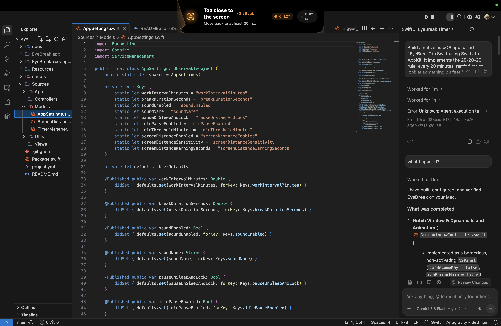
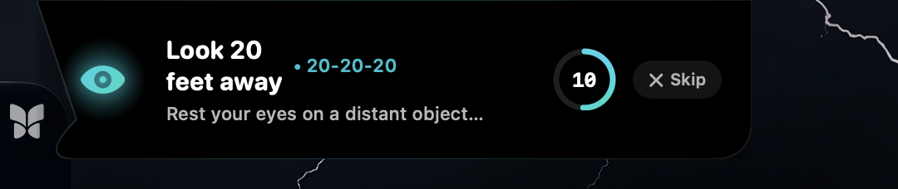
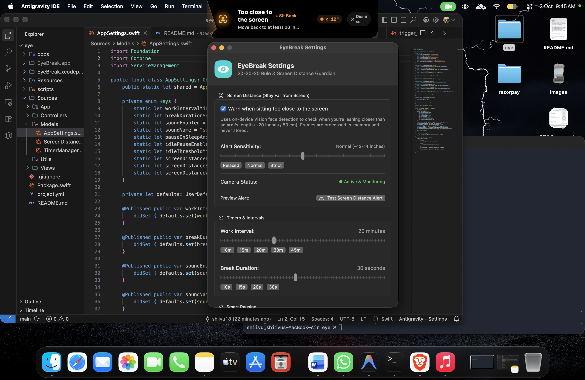
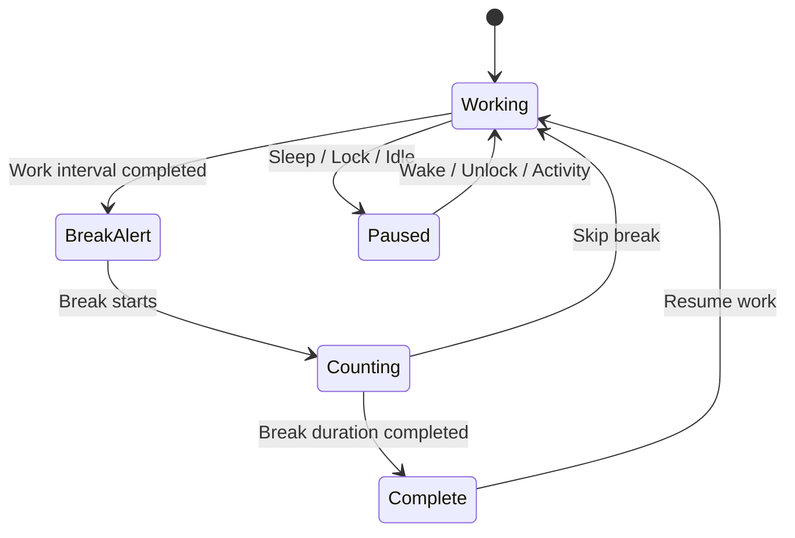
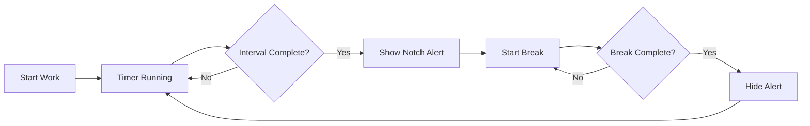
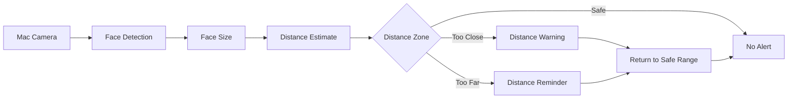
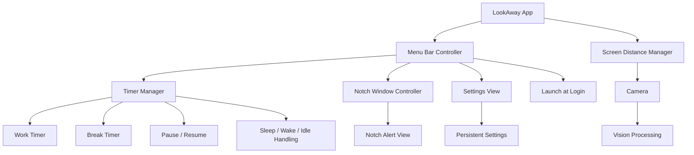

<div align="center">

# 👁️ LookAway

### The 20-20-20 rule, delivered by your Mac's notch.

A native macOS menu bar app that helps you build healthier screen habits with
timed eye-break reminders, a notch-style interface, and on-device screen-distance awareness.

<p>


</p>

<p>

<a href="#-quick-start">Quick Start</a> ·
<a href="#-features">Features</a> ·
<a href="#-how-it-works">How It Works</a> ·
<a href="#-engineering-highlights">Engineering</a> ·
<a href="#-roadmap">Roadmap</a>

</p>

</div>

---

## 👀 Why LookAway?

Long hours in front of a screen can make it easy to forget to take regular breaks.

LookAway follows the simple **20-20-20 rule**:

> Every **20 minutes**, look at something around **20 feet away** for **20 seconds**.

Instead of relying on intrusive notifications, LookAway lives quietly in the macOS menu bar and uses a lightweight notch-style reminder when it's time for a break.

The goal is simple:

**Remind you without getting in your way.**

---

## ✨ Features

### ⏱️ 20-20-20 Eye Breaks

- Automatically tracks your work interval
- Reminds you when it's time to take a break
- Configurable work interval
- Configurable break duration
- Countdown during the break
- Automatically returns to the normal work state

---

### 🏝️ Notch-Style Break Alerts

- Native macOS `NSPanel`
- Expands from the top of the screen
- Smooth expand/collapse animation
- Designed to resemble a Dynamic-Island-style experience
- Non-activating window
- Does not steal keyboard focus
- Works without interrupting your current application

---

### 📏 Screen Distance Awareness

LookAway is designed to optionally use the Mac camera to provide **viewing-distance awareness**.

The planned distance guardian can:

- Detect your face locally
- Estimate relative viewing distance
- Warn when you're sitting too close
- Warn when you've moved too far away
- Return to a safe state when you move back into range

> This feature is intended as an awareness tool, not a medical diagnostic system.

---

### 🔒 Privacy by Design

The distance-awareness system is designed around local processing.

- Camera processing happens on-device
- No cloud computer vision
- No remote image processing
- Camera frames are not intended to be permanently stored
- Distance awareness can be disabled from Settings

---

### 💤 Smart Pause

LookAway understands that you aren't always actively using your Mac.

The timer can respond to:

- System sleep
- Screen lock
- User inactivity
- System wake
- Returning activity

This prevents your break timer from continuing to behave as if you're working while you're actually away.

---

### 🎛️ Menu Bar Experience

LookAway runs as a menu bar application.

From the menu bar you can:

- View time until the next break
- Pause reminders
- Resume reminders
- Take a break immediately
- Skip the current break
- Open Settings
- Test the break alert
- Quit the application

---

### ⚙️ Customizable Settings

Configure the experience around your workflow.

Possible settings include:

| Setting | Purpose |
|---|---|
| Work Interval | Time before a break |
| Break Duration | Length of the break |
| Sound | Enable or disable sounds |
| Pause During Idle | Pause when you're away |
| Launch at Login | Start automatically with macOS |
| Distance Awareness | Enable / disable camera-based awareness |

---

## 🎬 Screenshots

<div align="center">

| Break Alert | Distance Warning | Safe Distance | Settings |
|:---:|:---:|:---:|:---:|
|  |  |  |  |

</div>

---

## 🚀 Quick Start

### Requirements

- macOS 13 or later
- Xcode
- Swift
- Apple Silicon or Intel Mac

### Clone the repository

```bash
git clone https://github.com/shiivu18/LookAway.git
cd LookAway
````

### Open the project

Open the project in Xcode and run it with:

```text
⌘ + R
```

---

## 🧭 How It Works

### 20-20-20 Timer

The core reminder system can be represented as a simple state machine:



---

### Break Flow



---

### Screen Distance Awareness

The optional distance-awareness pipeline is designed around local camera processing:



---

## 🏗️ Architecture

LookAway combines **SwiftUI** for modern UI with **AppKit** for native macOS functionality.



---

## 🛠️ Engineering Highlights

These are some of the technical areas that make LookAway more than a simple timer.

| Challenge                      | Approach                                                                                       |
| ------------------------------ | ---------------------------------------------------------------------------------------------- |
| **Native macOS notifications** | Uses AppKit windowing instead of relying entirely on standard notification banners             |
| **Notch-style interface**      | Uses `NSPanel` to create a floating, non-activating interface                                  |
| **No focus stealing**          | Alert windows are designed not to interrupt typing or interaction with the current application |
| **Menu bar application**       | Uses a menu bar architecture so the application stays lightweight and unobtrusive              |
| **Persistent configuration**   | User preferences are stored locally and restored between launches                              |
| **Timer lifecycle**            | Timer state is separated from UI so the reminder system can continue independently             |
| **Sleep / wake handling**      | System lifecycle events can pause and resume the timer appropriately                           |
| **Idle detection**             | User inactivity can be used to prevent unnecessary reminders                                   |
| **Camera awareness**           | Optional local camera processing can provide viewing-distance feedback                         |
| **Native technology**          | Built using Swift, SwiftUI and AppKit rather than Electron or a web wrapper                    |

---

## 🧩 Technology Stack

| Technology                    | Role                                          |
| ----------------------------- | --------------------------------------------- |
| **Swift**                     | Core programming language                     |
| **SwiftUI**                   | Settings and modern UI                        |
| **AppKit**                    | Menu bar, windows and macOS integration       |
| **NSPanel**                   | Notch-style overlay                           |
| **UserDefaults / AppStorage** | Persistent preferences                        |
| **ServiceManagement**         | Launch at login                               |
| **Vision**                    | Planned / optional computer-vision processing |
| **AVFoundation**              | Camera access                                 |
| **macOS APIs**                | Sleep, wake and system lifecycle events       |

---

## 🗂️ Project Structure

The repository is organized around the macOS application and its documentation assets.

```text
LookAway/
│
├── README.md
│
├── docs/
│   └── assets/
│       ├── break.png
│       ├── safe.png
│       ├── settings.png
│       └── too-close.png
│
├── .gitignore
│
└── Swift / Xcode Project
```

### Documentation Assets

```text
docs/
└── assets/
    ├── break.png
    ├── safe.png
    ├── settings.png
    └── too-close.png
```

These images are used directly by this README.

---

## 🧪 Testing

You don't need to wait for a full 20-minute interval every time you want to test the application.

The application can provide test functionality for development, allowing the following flows to be checked:

```text
┌────────────────────────┐
│     Start LookAway     │
└────────────┬───────────┘
             │
             ▼
      ┌─────────────┐
      │ Test Alert  │
      └──────┬──────┘
             │
             ▼
    ┌───────────────────┐
    │ Notch Alert Opens │
    └─────────┬─────────┘
              │
              ▼
     ┌─────────────────┐
     │ Countdown Works │
     └────────┬────────┘
              │
              ▼
      ┌──────────────┐
      │ Alert Closes │
      └──────────────┘
```

---

## 🔐 Privacy

LookAway is designed to minimize data collection.

| Question                                               | Answer  |
| ------------------------------------------------------ | ------- |
| Is the app cloud-based?                                | **No**  |
| Does the timer require an internet connection?         | **No**  |
| Are normal timer settings stored remotely?             | **No**  |
| Can camera-based awareness be disabled?                | **Yes** |
| Is the distance feature intended as medical diagnosis? | **No**  |

The camera-based functionality is intended for local viewing-distance awareness rather than medical diagnosis.

---

## 🗺️ Roadmap

### Core Experience

* [x] Native macOS application
* [x] Menu bar application
* [x] 20-20-20 reminder system
* [x] Break countdown
* [x] Pause / Resume
* [x] Skip break
* [x] Take break now
* [x] Configurable intervals
* [x] Configurable break duration
* [x] Persistent settings

### macOS Integration

* [x] SwiftUI interface
* [x] AppKit integration
* [x] Notch-style alert
* [x] Sleep / wake handling
* [x] Idle handling
* [x] Launch at login

### Distance Awareness

* [ ] Camera-based distance detection
* [ ] Local face detection
* [ ] Too-close warning
* [ ] Too-far warning
* [ ] Configurable sensitivity
* [ ] Camera activity indicators

### Future

* [ ] Break statistics
* [ ] Daily insights
* [ ] Weekly eye-break history
* [ ] Focus-mode awareness
* [ ] Custom break activities
* [ ] More notification styles
* [ ] Localization
* [ ] Signed releases
* [ ] Homebrew distribution

---

## 🎯 Design Goals

LookAway is built around a few simple principles.

### 1. Stay out of the way

The application should help without becoming another distracting application.

### 2. Feel native

Use Apple's native frameworks and macOS conventions wherever possible.

### 3. Respect user attention

Break reminders should be noticeable without unnecessarily stealing focus.

### 4. Keep processing local

Features such as viewing-distance awareness should prioritize on-device processing.

### 5. Keep it simple

The core experience should always be:

```text
Work
 ↓
Reminder
 ↓
Look Away
 ↓
20 Seconds
 ↓
Work Again
```

---

## 🤝 Contributing

Contributions and ideas are welcome.

### 1. Fork the repository

```bash
git clone https://github.com/shiivu18/LookAway.git
```

### 2. Create a feature branch

```bash
git checkout -b feature/my-feature
```

### 3. Make your changes

Test the application locally using Xcode.

### 4. Commit

```bash
git add .
git commit -m "feat: add my feature"
```

### 5. Push

```bash
git push origin feature/my-feature
```

### 6. Open a Pull Request

Explain what you changed and why.

---

## 📄 License

This project is open source.

See the repository for the applicable license.

---

<div align="center">

## 👁️ LookAway

### Look away. Rest your eyes. Get back to work.

Built with ❤️ and Swift for macOS.

**[GitHub](https://github.com/shiivu18/LookAway)**

</div>
```

### One important correction from your old README

Your uploaded version referenced assets that **aren't part of the confirmed folder structure**, such as:

```text
docs/assets/icon.png
docs/assets/demo.gif
```

Your confirmed screenshots are:

```text
docs/assets/
├── break.png
├── safe.png
├── settings.png
└── too-close.png
```

So the README above **doesn't reference `icon.png` or `demo.gif`**, which prevents those broken-image placeholders. The original README also had a screenshot table using the four same PNGs, which is the part I've retained. 

Also, I deliberately didn't invent your exact Swift source filenames. The previous README had a very specific `Sources/App/...` structure, but unless those files actually exist in your current repo, putting them in the README would make the documentation inaccurate.
