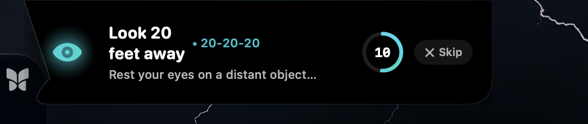
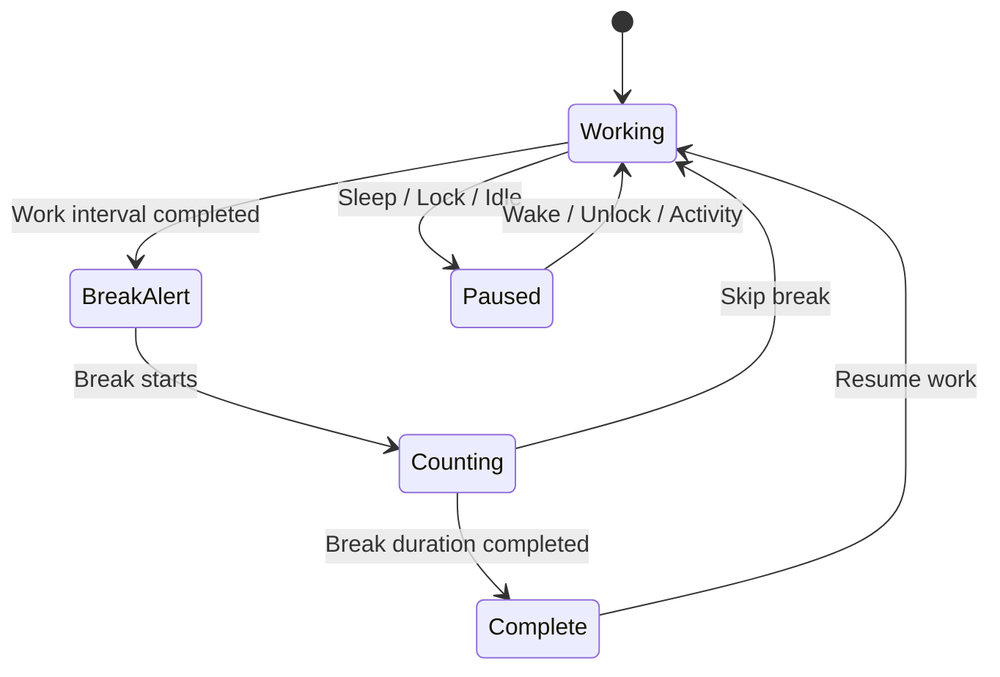
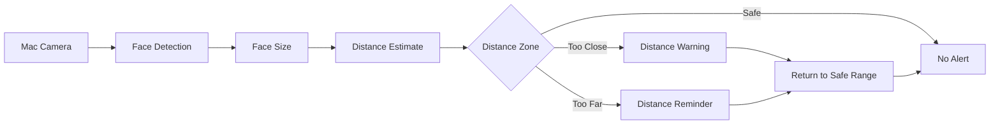
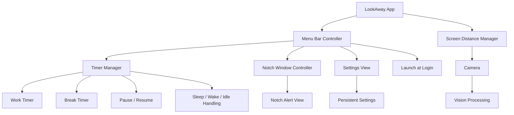

<div align="center">



# 👁️ LookAway

### Your eyes get a break. Your flow doesn't.

**A native macOS menu bar app that delivers the 20-20-20 rule through a Dynamic-Island-style notch alert, without ever stealing your focus.**

<p>


</p>

<p>
<a href="#-quick-start">Quick Start</a> ·
<a href="#-features">Features</a> ·
<a href="#-how-it-works">How It Works</a> ·
<a href="#-engineering-deep-dive">Engineering</a> ·
<a href="#-roadmap">Roadmap</a>
</p>

</div>

---

## 👀 Why LookAway?

Hours of screen time + deep focus = you forget to blink, let alone rest your eyes.

Most break apps fix that by throwing a loud popup in your face, which breaks your focus, the thing you were trying to protect in the first place.

LookAway takes a different approach, built on the **20-20-20 rule**:

> Every **20 minutes**, look at something **20 feet** away for **20 seconds**.

It lives quietly in your menu bar. When it's time, a small **notch-style panel** slides down from the top of your screen, counts down your break, and gets out of the way. It never grabs the keyboard, so you can finish your sentence first.

**Remind without interrupting. That's the whole idea.**

---

## 🎬 See It in Action

<div align="center">

| Break Alert | Too Close | Safe Distance | Settings |
|:---:|:---:|:---:|:---:|
|  |  |  |  |

</div>

---

## ✨ Features

### ⏱️ 20-20-20 Eye Breaks
- Tracks your work interval automatically
- Configurable work interval and break duration
- Live countdown during the break
- Returns to the work state on its own when the break ends

### 🏝️ Notch-Style Alerts
- Built on a native macOS `NSPanel`
- Smooth expand and collapse animation from the top of the screen
- **Non-activating**: it never steals keyboard focus, so your typing is never interrupted
- Works over whatever app you're in

### 💤 Smart Pause
The timer knows when you're not actually working and pauses on:
- System sleep and wake
- Screen lock and unlock
- User inactivity, resuming when you come back

No more "take a break!" alerts after you've been away from your desk for an hour.

### 🎛️ Menu Bar Control
View time until the next break, pause or resume, **take a break now**, skip a break, test the alert, open Settings, or quit. All from one menu.

### ⚙️ Settings That Stick

| Setting | What it does |
|---|---|
| Work Interval | Time before the next break |
| Break Duration | Length of each break |
| Sound | Turn alert sounds on or off |
| Pause During Idle | Pause when you step away |
| Launch at Login | Start automatically with macOS |
| Distance Awareness | Enable or disable camera-based awareness *(in development)* |

Preferences are stored locally and restored on every launch.

### 📏 Screen Distance Awareness *(in development)*
An optional guardian that uses the Mac camera to estimate how far you are from the screen, warning you when you're too close or too far, and settling back down once you're in a healthy range.

> An awareness tool, not a medical diagnostic system.

### 🔒 Privacy by Design
- Camera processing is designed to run **entirely on-device**
- No cloud vision, no remote image processing
- Camera frames are not intended to be stored
- Distance awareness can be turned off in Settings
- The timer needs **no internet connection**

---

## 🚀 Quick Start

**Requirements:** macOS 13+, Xcode, Apple Silicon or Intel Mac

```bash
git clone https://github.com/shiivu18/LookAway.git
cd LookAway
```

Open the project in Xcode and hit **⌘ R**.

> 💡 **Don't want to wait 20 minutes to see it work?** Use **Test Alert** from the menu bar to trigger the notch alert instantly.

---

## 🧭 How It Works

### The Timer State Machine



### Distance Awareness Pipeline



---

## 🏗️ Architecture

SwiftUI handles the modern UI. AppKit handles everything SwiftUI can't do on its own, such as menu bar items, floating panels, and system lifecycle events.



---

## 🛠️ Engineering Deep Dive

| Challenge | Approach |
|---|---|
| **Alerts that don't interrupt** | A floating, non-activating `NSPanel` instead of standard notification banners |
| **No focus stealing** | The panel never becomes key, so typing in your current app is never disturbed |
| **Lightweight footprint** | Menu bar architecture, native Swift, no Electron or web wrapper |
| **Reliable timing** | Timer state is separated from the UI, so the reminder logic runs independently of any view |
| **Real-world usage** | Sleep, wake, lock, and idle events pause and resume the timer correctly |
| **Persistence** | Preferences saved with `UserDefaults` / `@AppStorage`, restored between launches |
| **Launch at login** | Integrated through `ServiceManagement` |
| **Camera awareness** | `AVFoundation` + `Vision` for local, on-device face-based distance estimation |

### 🧩 Tech Stack

| Technology | Role |
|---|---|
| **Swift** | Core language |
| **SwiftUI** | Settings and modern UI |
| **AppKit** | Menu bar, windows, macOS integration |
| **NSPanel** | Notch-style overlay |
| **UserDefaults / AppStorage** | Persistent preferences |
| **ServiceManagement** | Launch at login |
| **AVFoundation** | Camera access |
| **Vision** | On-device face detection |

---

## 🗺️ Roadmap

**Core Experience**
- [x] Native macOS menu bar app
- [x] 20-20-20 reminder system and break countdown
- [x] Pause, resume, skip break, take break now
- [x] Configurable work interval and break duration
- [x] Persistent settings

**macOS Integration**
- [x] SwiftUI + AppKit interface
- [x] Notch-style alert
- [x] Sleep / wake and idle handling
- [x] Launch at login

**Distance Awareness**
- [ ] Camera-based distance detection
- [ ] Local face detection
- [ ] Too-close and too-far warnings
- [ ] Configurable sensitivity
- [ ] Camera activity indicator

**Future**
- [ ] Break statistics and daily insights
- [ ] Weekly eye-break history
- [ ] Focus-mode awareness
- [ ] Custom break activities
- [ ] More notification styles
- [ ] Localization
- [ ] Signed releases
- [ ] Homebrew distribution

---

## 🎯 Design Principles

1. **Stay out of the way.** Help without becoming another distraction.
2. **Feel native.** Apple frameworks and macOS conventions first.
3. **Respect attention.** Noticeable, never focus-stealing.
4. **Keep it local.** On-device processing, always.
5. **Keep it simple.**

```text
Work → Reminder → Look Away → 20 Seconds → Work Again
```

---

## 📁 Project Structure

```text
LookAway/
├── README.md
├── docs/
│   └── assets/
│       ├── break-alert.png
│       ├── safe.png
│       ├── settings.png
│       └── too-close.png
├── .gitignore
└── Swift / Xcode Project
```

---

## 🤝 Contributing

Ideas and contributions are welcome.

```bash
# 1. Fork, then clone your fork
git clone https://github.com/<your-username>/LookAway.git

# 2. Create a feature branch
git checkout -b feature/my-feature

# 3. Make changes and test locally in Xcode, then commit
git add .
git commit -m "feat: add my feature"

# 4. Push and open a Pull Request
git push origin feature/my-feature
```

---

## 👨‍💻 Author

**Shiva Kumara N** · Computer Science & Engineering @ VVCE, Mysuru

[](https://github.com/shiivu18)

---

<div align="center">

### 👁️ Look away. Rest your eyes. Get back to work.

Built with ❤️ and Swift for macOS

⭐ **If LookAway helps your eyes, drop a star. It helps a lot!**

</div>
